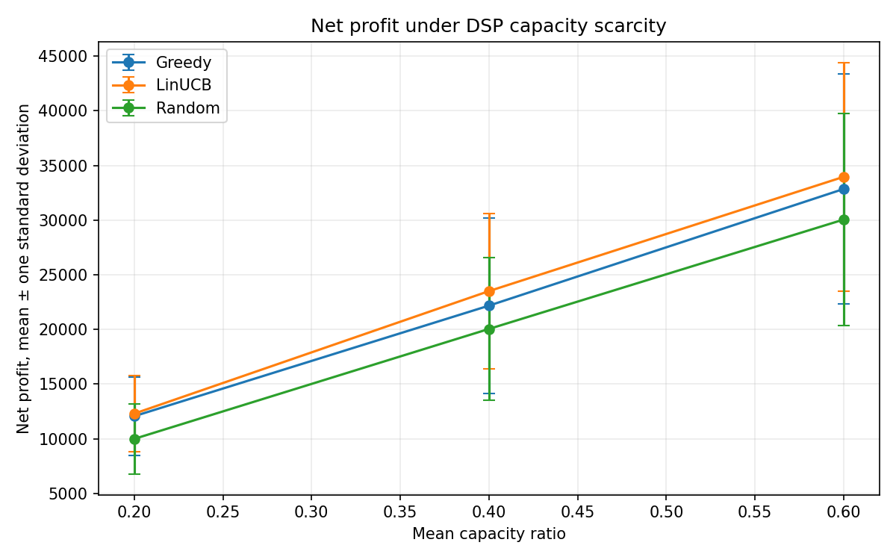
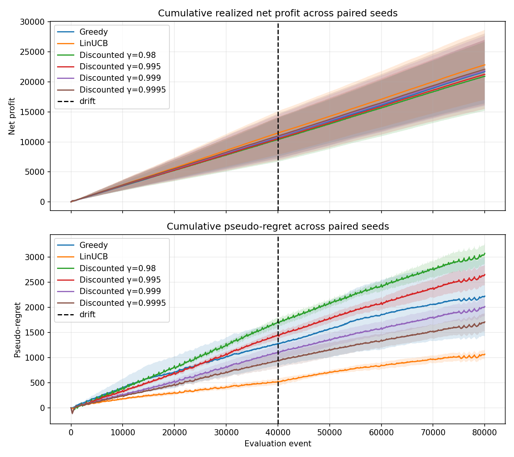

# Adaptive DSP Routing Under Capacity Constraints

A compact, interview-defensible experiment in contextual routing on real mobile-ad
traffic. Avazu rows provide chronological request contexts; downstream DSP behavior,
costs, capacities, and rewards are simulated because Avazu does **not** contain
multi-DSP counterfactual outcomes.

The scientific question is whether an online contextual policy can use scarce DSP
capacity more profitably than static routing, particularly after DSP preferences
change.

## Current milestone

The current implementation contains:

- a schema-validated loader that reconstructs one stream from the two supplied
  Parquet partitions and sorts it chronologically;
- a leakage-safe, train-only-fitted feature pipeline with at most 64 sparse features;
- reproducible linear and zero-inflated two-stage DSP worlds with optional abrupt
  drift;
- an optional chronological logistic CTR model that anchors DSP response propensity
  to an observed Avazu signal without using clicks as DSP rewards;
- ForwardAll, seeded Random, contextual Greedy, LinUCB, and batched Discounted
  LinUCB policies;
- shadow-price pacing backed by a non-negotiable hard per-window capacity limiter;
- a constrained oracle and an evaluation loop with routed-only feedback;
- unit tests for feature leakage, capacity, partial feedback, and reproducibility;
- small stationary and abrupt-drift experiment entry points.

See [PLAN.md](PLAN.md) for the inspected schema and project phases, and
[`docs/methodology.md`](docs/methodology.md) for the model and evaluation details.
The [seven-day learning guide](docs/learning_guide.md) explains the project in study
order, and [resume_bullets.md](docs/resume_bullets.md) contains evidence-backed bullet
points.

## Setup

Python 3.11+ is recommended.

```powershell
python -m venv .venv
.venv\Scripts\Activate.ps1
python -m pip install -r requirements.txt
```

The expected local files are:

```text
data/raw/avazu_train.parquet
data/raw/avazu_test.parquet
```

They are intentionally ignored by Git. Despite their names, these files are random
partitions of the same labeled 1,000,000-row sample, not a chronological train/test
split. The loader recombines them before ordering and splitting.

## Run

```powershell
$env:PYTHONPATH = "src"
python -m unittest discover -s tests -v
python experiments/run_stationary.py --n-events 2000
python experiments/run_drift.py --n-events 2000
python experiments/run_ctr_anchored.py --n-events 5000 --seeds 42
python experiments/run_suite.py
```

Useful options:

```powershell
python experiments/run_stationary.py --help
python experiments/run_drift.py --help
```

Generated metrics and plots go to `results/metrics/` and `results/figures/`.

## Results

The final suite used 100,000 systematically sampled chronological contexts spanning
the full ten-day source period. The first 20,000 fit preprocessing; the later 80,000
were evaluated with 49 features across three paired simulator seeds.

At 40% mean DSP capacity, LinUCB improved paired mean net profit over Random by
3,460.7 ± 617.8 units, or 17.3% of Random's mean profit. Mean pseudo-regret fell from
4,367.4 to 925.9, a 78.8% reduction. LinUCB's mean profit was about 6.0% above Greedy,
but with only three seeds this smaller difference should not be overstated.

The relative LinUCB profit improvement over Random increased as capacity became
scarcer: 13.0% at 60% capacity, 17.3% at 40%, and 23.1% at 20%.

In the abrupt-drift experiment, ordinary LinUCB had the highest mean post-drift
profit and lowest post-drift pseudo-regret. Discounted variants improved steadily as
`gamma` approached 1, but none beat ordinary LinUCB. This is a useful negative result:
aggressive forgetting added variance faster than it helped adaptation in this setup.

All 45 final policy runs had zero capacity violations. Full tables are in
[`results/metrics/experiment_report.md`](results/metrics/experiment_report.md).

The separate CTR-anchored experiment fits logistic regression on the first 20% of
the chronological sample and evaluates it on the later 80%. Its out-of-sample CTR
score is appended to the routing context and used as the shared relevance prior in
the DSP simulator. The observed click remains an evaluation label only and is never
a DSP reward. Results are written to
[`results/metrics/ctr_anchored_report.md`](results/metrics/ctr_anchored_report.md).
On 80,000 held-out events, the CTR model reached 0.6416 ROC-AUC, 0.4492 log
loss, and 0.1404 Brier score. It modestly overpredicted the observed 17.66% CTR
(mean prediction 19.59%). Across three paired synthetic DSP seeds at 40% mean
capacity, LinUCB produced 80.3% more mean net profit than Random with zero capacity
violations. This is a robustness result in a semi-synthetic world, not production
uplift.





## Methodological boundary

`click` is never a feature and never a DSP reward. The baseline ignores it; the
CTR-anchored extension uses it only as the supervised target and evaluation label.
The online policy sees outcomes only for DSPs to which it routed the request. The
simulator may retain the full counterfactual reward matrix solely for paired
evaluation and the non-causal oracle benchmark.

The small JSON files produced by the stationary and drift commands are smoke-test
outputs. Only the multi-seed suite supports the findings above.

## Code map

```text
src/adaptive_dsp_routing/data.py        loading, ordering, feature pipeline
src/adaptive_dsp_routing/ctr.py         chronological CTR baseline and prior
src/adaptive_dsp_routing/simulator.py   synthetic worlds and hard capacity
src/adaptive_dsp_routing/policies.py    baselines, linear bandits, pacing
src/adaptive_dsp_routing/evaluation.py  runner, oracle, metrics
src/adaptive_dsp_routing/plotting.py    Matplotlib comparison plots
experiments/                            runnable stationary and drift checks
experiments/run_suite.py                paired resume experiment suite
experiments/run_ctr_anchored.py         data-anchored robustness experiment
tests/                                  scientific invariants
```
